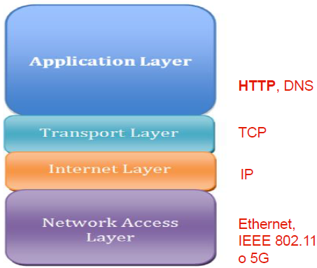
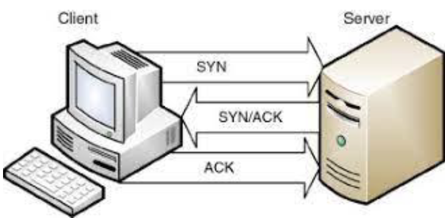

# 01.1 - TCP-IP <!-- omit from toc -->

- [Architettura del TCP/IP](#architettura-del-tcpip)
  - [Livello 1: Accesso alla rete](#livello-1-accesso-alla-rete)
  - [Livello 2: Internet (IP)](#livello-2-internet-ip)
  - [Livello 3: Trasporto (TCP)](#livello-3-trasporto-tcp)
  - [Livello 4: Applicazione (HTTP)](#livello-4-applicazione-http)

> [**Return to full index**](00%20-%20Index.md)

## Architettura del TCP/IP

TCP (Transmission Control Protocol) e IP (Internet Protocol) sono protocolli di rete separati:

- **IP** ottiene l'indirizzo a cui vengono inviati i dati.
- **TCP** garantisce l'esatto recapito dei dati una volta trovato l'indirizzo IP.

Insieme formano la nota suite di protocolli TCP/IP.

Il modello prevede quattro livelli:
- **Accesso alla rete**.
- **Internet**.
- **Trasporto**.
- **Applicazione**.

Questi livelli creano una **suite di protocolli**; il modello TCP/IP passa i dati attraverso questi livelli in un determinato ordine quando un utente invia le informazioni e poi, in ordine inverso, quando vengono ricevuti.

### Livello 1: Accesso alla rete

Il livello di accesso alla rete, noto anche come livello di collegamento dati, gestisce l'**infrastruttura fisica** che consente ai computer di comunicare tra loro in internet. Si applica a cavi Ethernet, reti wireless, schede di interfaccia di rete, driver nel computer e così via.

### Livello 2: Internet (IP)

Il livello Internet, noto anche come livello di rete, controlla il **flusso e** l'**instradamento del traffico** per garantire che i dati vengano inviati in modo rapido e accurato. 
\
Questo livello è anche responsabile del **riassemblaggio dei pacchetti di dati** arrivati a destinazione. In caso di traffico intenso, il livello Internet potrebbe impiegare più tempo per inviare un file, ma con minori possibilità che un errore lo danneggi.

Il ruolo del protocollo IP è quello di instradare i pacchetti verso il server corretto.

### Livello 3: Trasporto (TCP)

Il livello di trasporto consente una **connessione dati affidabile** tra due dispositivi comunicanti. **Suddivide i dati in pacchetti**, **riconosce i pacchetti ricevuti** dal mittente e **garantisce che il destinatario riconosca i pacchetti** ricevuti.
\
Questo livello implementa inoltre il processo **handshake** (3-way-handshake) che si suddivide in tre passaggi:
1. Il client invia un pacchetto di sincronizzazione.
2. Il server invia due pacchetti, uno di sincronizzazione, un altro di permesso.
3. Il client invia i dati.

Dove "ACK" sta per "acknowledgement".

### Livello 4: Applicazione (HTTP)

Il livello applicazione consiste nel **gruppo di applicazioni che consentono all'utente di accedere alla rete**. 
\
Questo si traduce in email, app di messaggistica, programmi di archiviazione cloud, e web browser. Si tratta sostanzialmente di quel che l'utente finale vede e con cui interagisce durante l'invio e la ricezione dei dati.

HTTP opera in questo livello utilizzando il TCP (livello precedente) per garantire la consegna affidabile dei dati. I pacchetti HTTP sono incapsulati in quelli TCP/IP.
